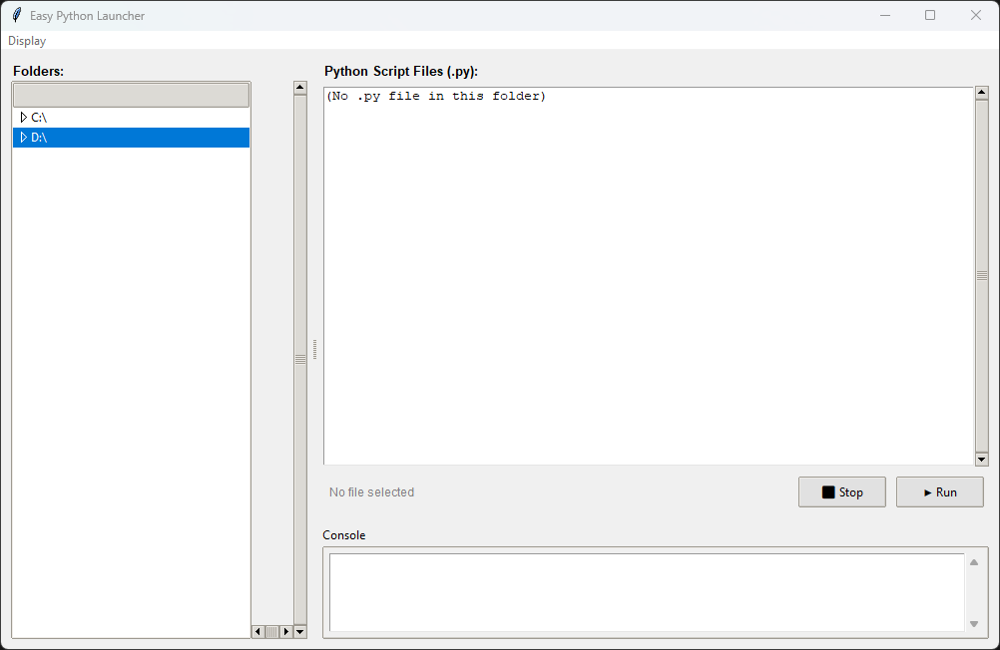
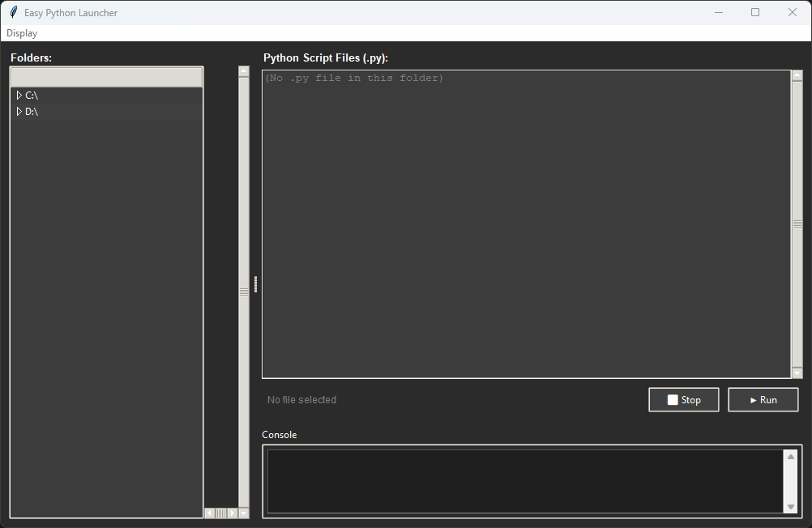

# Easy Python Launcher

A simple and elegant GUI application for browsing and executing Python scripts directly from a file explorer interface.


## Features

- 🗂️ **File Explorer Interface**: Browse your entire file system with a familiar tree-view layout
- ▶️ **Quick Script Execution**: Run Python scripts with a single click
- 🔄 **Multi-Process Support**: Launch multiple scripts simultaneously and manage them independently
- ⏹️ **Selective Process Control**: Stop specific running scripts by selecting them
- 🖥️ **Integrated Console**: View real-time script output directly in the application
- 🌓 **Dark/Light Mode**: Toggle between themes with your preference saved for future sessions
- 💾 **Persistent Settings**: Your theme preference is automatically saved
- 🖱️ **Double-Click Launch**: Quick execution by double-clicking on any .py file

## Screenshots

### Light Mode
The clean, professional light theme perfect for daytime coding.


### Dark Mode
Easy on the eyes for late-night scripting sessions with green console output.


## Installation

### Option 1: Standalone Executable (Windows Only)

**No Python installation required to run the launcher itself!**

1. Go to the [Releases](https://github.com/yourusername/easy-python-launcher/releases) page
2. Download the latest `EasyPythonLauncher.exe` for Windows
3. Run the executable - that's it!

The standalone executable doesn't require Python to be installed to run the launcher interface. However, you'll still need Python installed on your system to execute your Python scripts 😁

**Note for Linux/macOS users**: The pre-compiled executable is Windows-only. Please use Option 2 (run from source) or build your own executable following the [BUILD.md](BUILD.md) guide.

### Option 2: Run from Source (All Platforms)

If you prefer to run from source, want to modify the code, or are using Linux/macOS:

#### Prerequisites
- Python 3.6 or higher
- tkinter (usually included with Python)

#### Setup

1. Clone this repository:
```bash
git clone https://github.com/yourusername/easy-python-launcher.git
cd easy-python-launcher
```

2. Run the application:
```bash
python EasyPythonLauncher.py
```

#### Building Your Own Executable

If you want to create your own compiled version for your platform:

1. Install PyInstaller:
```bash
pip install pyinstaller
```

2. Build the executable:
```bash
# Windows
pyinstaller --onefile --windowed --name EasyPythonLauncher EasyPythonLauncher.py

# Linux/macOS
pyinstaller --onefile --name EasyPythonLauncher EasyPythonLauncher.py
```

The executable will be created in the `dist/` folder.

For detailed build instructions and advanced options, see [BUILD.md](BUILD.md).

## Usage

### Launching Scripts
1. **Navigate**: Use the folder tree on the left to browse to your Python scripts
2. **Select**: Click on any `.py` file in the right panel
3. **Run**: Click the "▶ Run" button or double-click the file

### Managing Running Scripts
- **Multiple Scripts**: Launch as many scripts as you need - they run independently
- **Visual Indicators**: Running scripts show "(Running ▶)" in green when selected
- **Stop Specific Script**: Select the script you want to stop, then click "⬛ Stop"
- **Console Output**: Watch real-time output in the integrated console

### Theme Toggle
- Go to **Display** → **Dark Mode** in the menu bar
- Your preference is automatically saved for next time

## Configuration

Settings are stored in your home directory:
- Windows: `C:\Users\YourName\.easy_python_launcher_config.json`
- Linux/macOS: `~/.easy_python_launcher_config.json`

## Platform Support

### Windows
- Full support for all drives (C:\, D:\, E:\, etc.)
- Native Windows path handling

### Linux/macOS
- Starts from root directory (/)
- Full Unix filesystem support

## How It Works

**Multi-Process Architecture**: Each script runs in its own subprocess, allowing true parallel execution. The launcher maintains a dictionary of running processes, enabling precise control over individual scripts.

**Smart UI Updates**: The interface dynamically updates to show which scripts are running, automatically enabling/disabling controls based on selection state.

**Cross-Platform**: Uses platform-specific path detection to work seamlessly on Windows, Linux, and macOS.

**Standalone Executable**: The compiled version bundles Python and all dependencies into a single executable using PyInstaller, making it easy to distribute and use without requiring a Python installation.

## Contributing

Contributions are welcome! Feel free to:
- Report bugs
- Suggest new features
- Submit pull requests

## License

This project is licensed under the MIT License - see the [LICENSE](LICENSE) file for details.

## Author

Created by Vince

## Acknowledgments

- Built with Python's tkinter for maximum compatibility
- Inspired by the need for a simpler way to test Python scripts during development

---

**Note**: This tool is designed for development and testing purposes. Always review scripts before running them, especially from untrusted sources.
